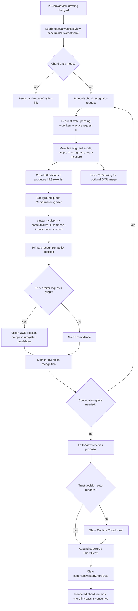

# Smart Chart Editor Recognition Execution Audit

Status: Sprint 34 supporting audit
Date: 2026-05-24
Branch: `main`
Baseline commit: `c238964 Extract chord recognition request state`
Primary source of truth: `docs/smart-chart-sprint-source-of-truth.md`

## Summary

Sprint 34 pauses the `LeadSheetCanvasHostView.swift` extraction sequence and audits the remaining editor-to-recognition execution path. The finding is that the easy behavior-preserving bridge cleanup is mostly done. The remaining chord path is not just view scaffolding; it is the live execution boundary between native ink, async recognition, optional OCR evidence, trust policy, SwiftUI confirmation state, chart mutation, diagnostics, and the intentional chord-ink clear rule.

Recommendation: do not keep slicing this path mechanically. The next move should be either a small documented execution-boundary design or a product validation sprint with real Pencil input. Only continue code extraction if the helper is obviously behavior-preserving and avoids recognition execution, OCR gating, callbacks, chart mutation, and chord ink lifecycle.

## Current Verification State

- `main` is clean and synced with `origin/main`.
- Commit `c238964 Extract chord recognition request state` passed required GitHub Actions: SwiftPM tests, iOS simulator tests, and Analyze Swift.
- Supabase and Expo status contexts remain queued with zero check runs; they are not current required app health for this repo.
- Sprint 34 is doc/audit-only unless a later commit explicitly changes runtime code.

## Remaining Live Path

## File Responsibilities

### `LeadSheetCanvasHostView.swift`

Still owns the live execution bridge:

- receives `PKCanvasViewDelegate.canvasViewDrawingDidChange`
- schedules chord recognition after the idle delay
- cancels page/rhythm ink persistence when chord mode is active
- guards request identity and current mode/scope
- reads current `PKDrawing` data and converts strokes through `PencilKitInkAdapter`
- selects the target measure/fraction through `LeadSheetChordInkRecognitionTargeting`
- sends recognition work to `chordInkRecognitionQueue`
- invokes `ChordInkRecognizer`
- asks `ChordRecognitionTrustArbiter` whether OCR is worth running
- renders optional OCR image through `LeadSheetChordInkImageRenderer`
- returns to the main thread
- applies continuation-grace scheduling
- calls `onChordInkRecognitionProposal`

This file should keep these responsibilities until there is a clearer execution-boundary design. Moving them blindly risks changing timing, cancellation, stale-request handling, OCR availability, or proposal order.

### `LeadSheetChordInkRecognitionRequestState.swift`

Owns request bookkeeping only:

- pending work item
- active request ID
- last recognized drawing data
- continuation-grace drawing data

This was a safe extraction because it did not own recognition execution, OCR, chart mutation, or chord lifecycle.

### `EditorView.swift`

Owns the SwiftUI side of recognition resolution:

- receives `onChordInkRecognitionProposal`
- blocks duplicate confirmation while a chord sheet is already pending
- runs primary policy and trust-arbiter decision for UI/auto-render routing
- auto-renders when trust policy says it can
- otherwise shows `ChordInkConfirmationSheetView`
- validates selected/manual chord text through `ChordRecognitionCompendium`
- appends a structured `ChordEvent`
- records debug diagnostics in debug/simulator builds
- clears `pageHandwrittenChordData` after commit or rewrite

This is where the current product rule is enforced: accepting/rendering a chord consumes the chord-writing pass and clears the chord ink layer.

### Recognition Package

The recognition package already has the intended authority split:

- `ChordInkRecognizer` orchestrates `StrokeClusterer`, `GestureTemplateRecognizer`, semantic glyph contextualization, candidate composition, compendium matching, optional symbol-ledger diagnostics, and metrics.
- `ChordInkRecognitionPolicy` makes the primary auto-render vs confirm decision.
- `ChordRecognitionTrustArbiter` decorates the primary decision with OCR evidence and can only use supported, compendium-normalized OCR candidates.
- `ChordOCRCandidateProvider` is optional and Vision-backed only when available.

This layer should not be retuned during editor bridge cleanup.

## What Is Still Bloated

- `LeadSheetCanvasHostView.swift` remains broad at roughly `1147` lines.
- `EditorView.swift` remains broad at roughly `1544` lines.
- `ChordInkSemanticCandidateComposer.swift` remains the largest recognition-maintenance surface.

The bloat is now mostly concentration of responsibilities, not obvious dead runtime detours. No tracked cache/raster/direct-ink detour files remain in the current tree.

## What Should Not Be Extracted Yet

Do not extract the remaining chord recognition execution path until there is an explicit design for:

- stale request cancellation across main/background queues
- mode changes while recognition is in flight
- continuation-grace requeue semantics
- OCR provider lifetime and optional Vision availability
- where policy/trust decisions are evaluated for auto-render vs confirmation
- where `pageHandwrittenChordData` is cleared
- where debug/simulator diagnostics attach to accepted chords

The current path works because these pieces are close together. Splitting them without a boundary could create subtle bugs without reducing real product risk.

## Safe Next Options

1. Real Pencil validation sprint
   - Best product value.
   - Confirms the recovered pipeline with actual user-like input before any tuning.
   - Should capture observations and transferable regressions, not train the app from one writer.
   - Must not become a continuous personal chord-sample pass.

2. Editor execution-boundary design sprint
   - Write a small design for a future `ChordInkRecognitionSession` or `ChordInkRecognitionCoordinator`.
   - No runtime behavior change until the contract is clear.
   - Should define inputs, outputs, cancellation semantics, threading, and ownership of OCR/policy/proposal routing.

3. `EditorView.swift` surface cleanup
   - Lower risk than touching the remaining live recognition execution path.
   - Good candidates are note/time-signature sheet boundaries if they are still inline and behavior-preserving.

4. Recognition semantic recipe split
   - Useful only if review surface remains painful.
   - Must stay behavior-preserving and avoid score/parser/compendium changes.

## Sprint 34 Recommendation

Stop the editor-bridge extraction sequence here unless the next sprint is explicitly a design sprint for recognition-session boundaries.

The audit plan has largely completed its original recovery goal: dead detours and default training/corpus authority were removed or demoted, the source-of-truth pipeline is restored, and broad editor files were reduced through many small behavior-preserving extractions. The remaining work is no longer cleanup for cleanup's sake. It should be selected based on product evidence:

- real handwriting validation across general/user-like writing behavior,
- correction-loop speed,
- Library organization,
- export quality,
- or a deliberate recognition-session architecture design.
