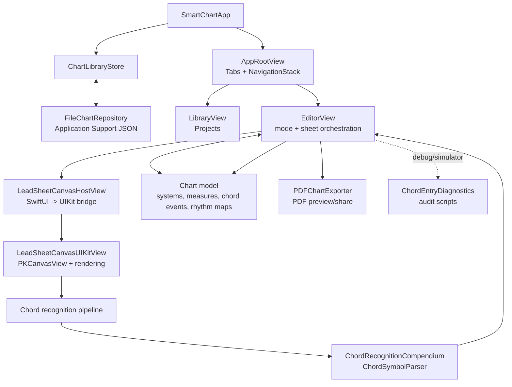
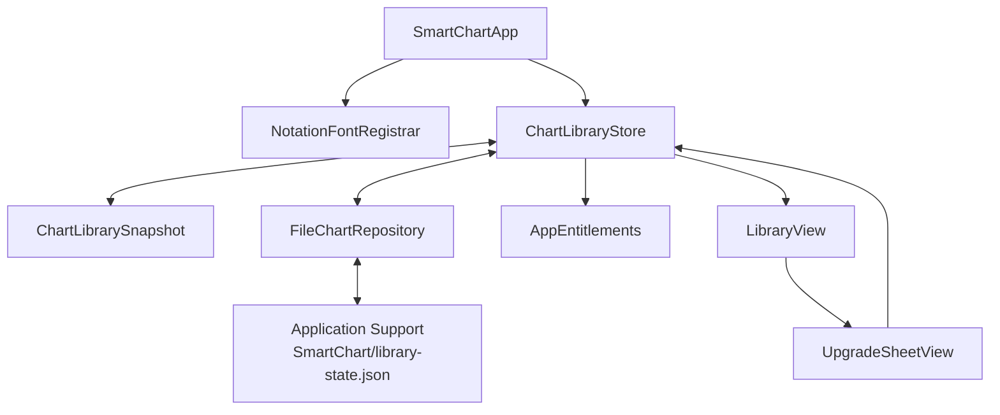
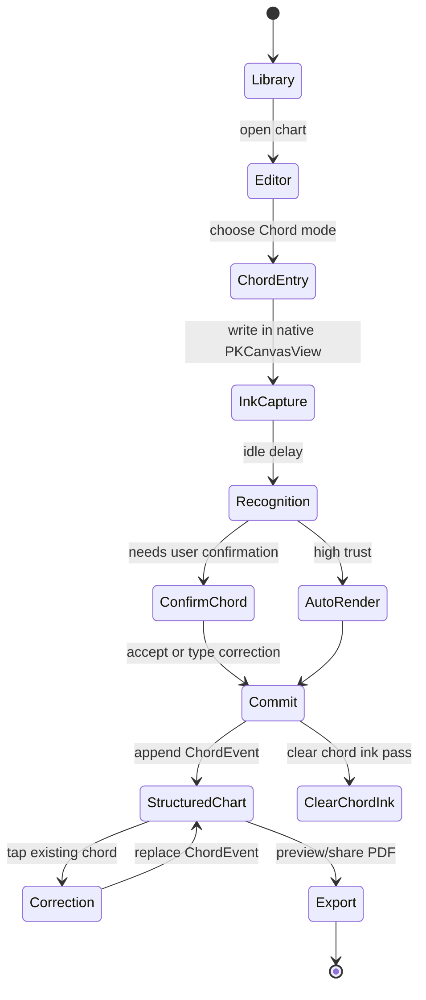
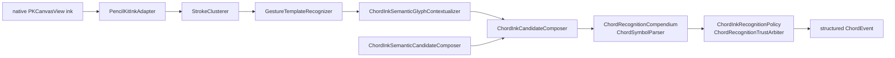
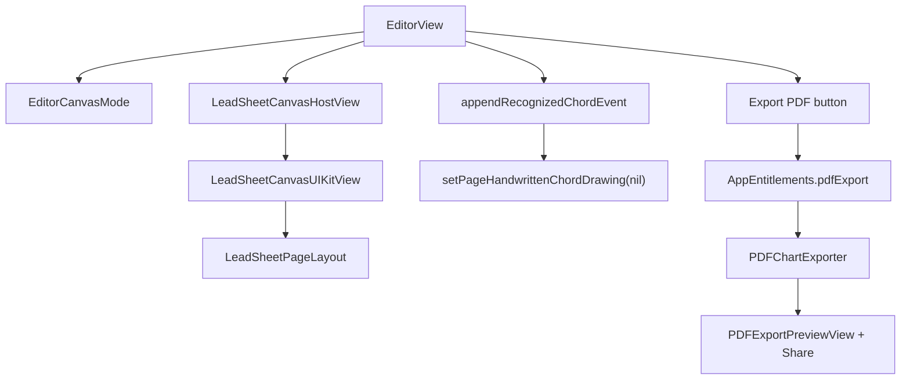
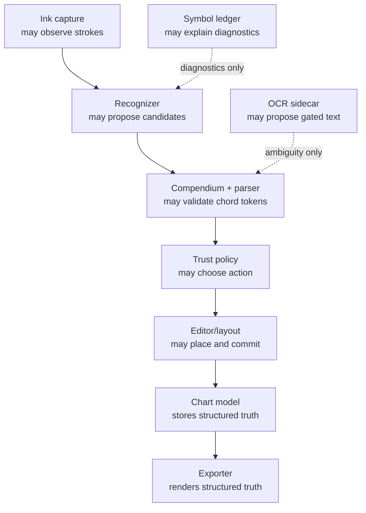

# Smart Chart Post-Merge App Audit

Status: complete; Sprint 13-14 follow-through complete
Date: 2026-05-23
Branch: `main`
Baseline: `31f1dde Start sprint twelve app audit`
Source of truth: `docs/smart-chart-sprint-source-of-truth.md`

## Purpose

This Sprint 12 audit captures the merged Smart Chart app architecture after PR
[#4](https://github.com/beniandthe/smart-chart/pull/4). It is meant to align
the product workflow, live code paths, diagnostic sidecars, local drift, and the
next few sprints before more implementation work begins.

The north-star workflow remains:

```text
open -> write -> recognize -> snap -> fix -> export
```

## Current Verdict

Smart Chart is now back on one recognizable path: local-first chart library,
SwiftUI editor shell, native `PKCanvasView` ink capture, recovered chord
recognition pipeline, compendium/parser validation, structured `ChordEvent`
commit, fast correction, and native PDF export.

The tracked app is aligned enough to move forward. The local duplicate test
files found during the audit were removed after explicit user approval, local
verification is clean again, and a fresh simulator smoke pass from `main`
confirmed the main product path through library open, chord chart open, chord
mode, export, and PDF preview. The largest risks are now maintenance and clarity
risks, not obvious runtime detours:

- Recognition is source-of-truth aligned, but several files are still large and
  carry family-specific repairs that are hard to audit quickly.
- The editor is correctly the owner of chord ink lifecycle and placement, but
  `EditorView.swift` and `LeadSheetCanvasHostView.swift` remain broad
  orchestration surfaces.
- Debug/audit tooling is mostly separated from live behavior, but the project
  still needs a clean "what runs by default" map for future work.
- The local `* 2.swift` duplicate test files were workspace drift, not tracked
  app state. They are now gone after explicit cleanup approval.
- Documentation authority is much better than before; `README.md` now points to
  the living sprint doc and this audit as the current implementation authority.

## Evidence Snapshot

- PR #4 merged into `main` as `1b792df`.
- Sprint 12 kickoff commit is `1e4ef82`.
- Sprint 12 audit draft commit is `31f1dde`.
- GitHub checks on `1e4ef82`: SwiftPM tests, iOS simulator tests, and Analyze
  Swift all completed successfully.
- GitHub checks on `31f1dde`: SwiftPM tests, iOS simulator tests, and Analyze
  Swift all completed successfully.
- `14` local duplicate `SmartChartTests/Recognition/* 2.swift` files were
  removed after explicit user approval. They were byte-identical to tracked
  counterparts but broke SwiftPM test discovery as extra sources.
- `find SmartChartTests/Recognition -maxdepth 1 -name '* 2.swift' -print`
  now returns no files.
- Local `swift test --scratch-path /tmp/SmartChartSwiftBuild-sprint14` passed
  with `311` tests, `1` skipped, `0` failures after cleanup and Sprint 14's
  bridge refactor.
- `python3 -m py_compile scripts/audit_chord_entry_diagnostics.py
  scripts/import_chord_fixture.py scripts/watch_simulator_chord_fixtures.py`
  passed locally.
- `xcodegen generate` completed.
- iOS simulator `SmartChart` scheme passed on iPad Air 11-inch (M4), iOS
  26.4.1, with `352` passed, `1` skipped, `0` failed.
- Live simulator smoke launched `Smart Chart`, opened `Chord Writing Test
  Chart`, entered chord mode, opened export from the editor, and reached PDF
  preview/share. It also opened `Turnaround Study` and verified rendered chord
  selection affordance.
- Fixture corpus count: `645` JSON files under `SmartChartTests/Fixtures/Ink`,
  about `6.7M`.

## Whole-App Architecture



### Architecture Feedback

What is aligned:

- The app is local-first and does not depend on a backend for v1 behavior.
- SwiftPM and iOS/Xcode targets have a useful split: pure domain/recognition
  code is testable through SwiftPM, while editor/PencilKit coverage is protected
  by the iOS simulator scheme.
- The model layer is structured around charts, systems, measures, chord events,
  rhythm maps, and raw ink storage. That matches the core design rule:
  structured objects over raw ink alone.
- Export is a service (`PDFChartExporter`) rather than a direct editor concern.

What needs continued attention:

- `ChartLibraryStore` persists on every published change. That is simple and
  probably fine for prototype scale, but a future persistence sprint should
  consider debounce/error surfacing before large libraries.
- `AppRootView` already has placeholder Workspace and Settings tabs. They are
  harmless, but future app shell work should decide whether they are true v1
  navigation or placeholder surface area.
- `LibraryView` is functional but still reads like a prototype surface: it
  mixes a large hero, project list, free-tier capacity text, and debug-only
  chord test entry. That is acceptable now, but v1 should converge on a tighter
  project-first library.
- The active document authority is split between the living sprint doc, core
  design doc, README, and older planning docs. The living sprint doc should
  remain the first stop for implementation decisions.

## App Shell, Persistence, And Entitlements



Feedback:

- The local JSON repository is a good v1 boundary because it keeps persistence
  simple and testable.
- The store owns both chart library state and entitlement state. That is fine
  for prototype speed, but StoreKit wiring should probably introduce a clearer
  purchase/entitlement adapter rather than letting the library store become a
  commerce hub.
- Free vs Pro gating already exists for chart count and PDF export. The current
  "Use Pro Preview" flow is explicitly a prototype local entitlement switch.
- Persistence errors are printed, not surfaced. That is tolerable during
  prototype work, but it is not enough for production chart ownership.

## User Workflow And State



### Workflow Feedback

What is aligned:

- Chord entry stays in the product flow: write naturally, recognize, snap to a
  structured event, correct quickly, export cleanly.
- The current product decision is explicit: accepting/rendering a chord consumes
  the current chord-writing pass and clears the live chord ink layer.
- Correction remains a first-class escape hatch, which is right because
  correction speed matters more than perfect recognition.

What still needs live validation:

- A fresh simulator run from `main` should verify library open, chart creation,
  chord mode, correction, export reachability, and PDF preview after the PR
  merge.
- Handwriting quality should not be retuned from synthetic simulator strokes.
  Future quality work should use real Pencil/user input or fixture replay.

## Chord Recognition Pipeline



### Recognition Feedback

What is aligned:

- `ChordInkRecognizer` is again a facade/orchestrator instead of the owner of
  every semantic repair.
- `ChordInkSymbolLedger` is gated behind recognition options and does not run by
  default on the live path.
- OCR remains ambiguity-only and compendium-gated.
- The compendium/parser layer is still the final chord authority.

Maintenance risks:

- `StrokeClusterer.swift` and `StrokeClustererSupport.swift` together are nearly
  3k lines. They contain real recovered behavior, but should eventually become
  named deterministic passes.
- `GestureTemplateRecognizer.swift` is still large and mixes template matching
  with shape gates.
- `ChordInkSemanticCandidateComposer.swift` remains the largest semantic recipe
  file at about 1.6k lines.
- `ChordInkCandidateScoringPolicy.swift` is useful as a boundary, but it is
  still a dense cluster of scoring knobs. Threshold changes should stay tied to
  fixture evidence.
- `BasicMajorChordCompendium` remains as a compatibility wrapper around
  `ChordRecognitionCompendium` and is still referenced by tests. It is not a
  live runtime fork, but the old name is stale and should eventually disappear.

## Editor And Export System



Feedback:

- `EditorCanvasMode` is a useful authority surface. It centralizes which modes
  lock document actions, allow export, allow selection, and own ink capture.
- `LeadSheetCanvasUIKitView` correctly keeps native `PKCanvasView` as the ink
  renderer. That remains the right boundary for Apple Pencil feel.
- `EditorView` owns proposal confirmation, correction, entitlement-gated export,
  and diagnostic recording. It works, but it is a broad coordination surface and
  should be split only where a behavior-preserving seam is obvious.
- PDF export uses a service and PDF preview/share view, which is the right shape.
  The renderer is separate from editor UI and now avoids editor-only placeholder
  text in exports.
- Current export rendering is a clean prototype renderer, not yet a full shared
  geometry renderer with the on-screen page. Future layout/export unification is
  still a valid product polish target once authoring behavior stabilizes.

## Authority Boundaries



Hard rules to preserve:

- Parser/compendium validate chord tokens.
- Recognition proposes, but does not own beat placement.
- Editor/layout decides target measure and fraction.
- Diagnostics may explain; they do not render a different answer.
- Export renders structured chart state, not editor-only placeholder text.

## Live Runtime vs Debug And Tooling

Live runtime:

- `ChartLibraryStore.live()` loads/saves a local JSON snapshot.
- `AppRootView` routes Projects to `EditorView`.
- `LeadSheetCanvasUIKitView` hosts `PKCanvasView` and routes mode-specific ink.
- Chord mode schedules recognition after idle delay.
- Accepted chord candidates append `ChordEvent` objects and clear chord ink.
- PDF export uses structured chart data.
- Pro gating decides whether export opens the upgrade sheet or generates a PDF.

Debug/simulator/tooling:

- Chord writing test chart creation exists only in debug/simulator contexts.
- Chord entry diagnostics record simulator/debug evidence.
- Symbol ledger diagnostics are opt-in through recognition options.
- Fixture import/watch/audit scripts support development and regression loops.
- `SmartChartTests/Fixtures/Ink` is test corpus, not app runtime data.
- `LibraryView` exposes the disposable Chord Writing Test Chart only in debug or
  simulator builds.

## Local Drift And Bloat Watchlist

Immediate local drift:

- The untracked duplicate files under `SmartChartTests/Recognition` with names
  ending in ` 2.swift` were removed after explicit user approval.
- No duplicate `* 2.swift` files remain in `SmartChartTests/Recognition`.
- Local SwiftPM verification is clean again.

Tracked bloat/complexity:

- Recognition fixture corpus is valuable but large.
- Large recognition files are now organized better than before, but still need
  future behavior-preserving splits.
- `EditorView.swift` and `LeadSheetCanvasHostView.swift` remain broad
  coordination surfaces.
- README source-of-truth wording has been reconciled with the living sprint doc.

## Verification Status

Tracked GitHub state:

- `1e4ef82` passed SwiftPM tests, iOS simulator tests, and Analyze Swift on
  GitHub.
- `31f1dde` passed SwiftPM tests, iOS simulator tests, and Analyze Swift on
  GitHub.

Local workspace state:

- `find SmartChartTests/Recognition -maxdepth 1 -name '* 2.swift' -print`
  returns no duplicate files.
- `swift test --scratch-path /tmp/SmartChartSwiftBuild-sprint14` passed with
  `311` tests, `1` skipped, `0` failures.
- `python3 -m py_compile scripts/audit_chord_entry_diagnostics.py
  scripts/import_chord_fixture.py scripts/watch_simulator_chord_fixtures.py`
  passed.
- `xcodegen generate` completed.
- iOS simulator `SmartChart` scheme passed with `352` tests, `1` skipped, `0`
  failures on iPad Air 11-inch (M4), iOS 26.4.1.
- `git diff --check`
  passed.

Implication:

- The remote tracked project is green.
- The local workspace is verification-clean again.
- The first editor boundary cleanup is behavior-preserving and covered by both
  SwiftPM and iOS simulator verification.

## Recommended Next Sprints

### Sprint 13: Local Hygiene And Product Smoke

Status: complete.

Goal: prove the merged `main` app path live and decide what to do with local
duplicate files.

Acceptance criteria:

- Fresh simulator smoke covered app launch, library open, opening an existing
  chord chart, chord mode, export, PDF preview/share, and rendered chord
  selection affordance. Correction behavior remains covered by the automated
  chart editing and iOS simulator suites.
- Local duplicate `* 2.swift` files were explicitly removed.
- Local SwiftPM verification passes again after the duplicate-file cleanup.
- No recognition retuning.

### Sprint 14: Editor Surface Boundary Cleanup

Status: complete.

Goal: reduce editor coordination risk without changing behavior.

Acceptance criteria:

- Extracted duplicate `LeadSheetCanvasHostView` SwiftUI-to-UIKit configuration
  into one private `configure(_:context:)` helper.
- Preserved native `PKCanvasView` feel and chord ink lifecycle.
- Ran SwiftPM tests and iOS simulator tests.

### Sprint 15 Candidate: Recognition Maintenance Split

Goal: split one remaining large recognition area with fixture evidence.

Acceptance criteria:

- Choose one target: semantic candidate recipes, stroke clustering passes, or
  glyph-shape gates.
- Move code without score retuning.
- Run focused recognition tests, full SwiftPM tests, scripts py-compile, and
  iOS simulator tests if any editor-facing API changes.

## Sprint 12 Closeout State

- Sprint 12 is closed in the living source-of-truth document.
- Sprint 13 and Sprint 14 follow-through are complete.
- Sprint 15 should not begin until the user gives the next priority input.
